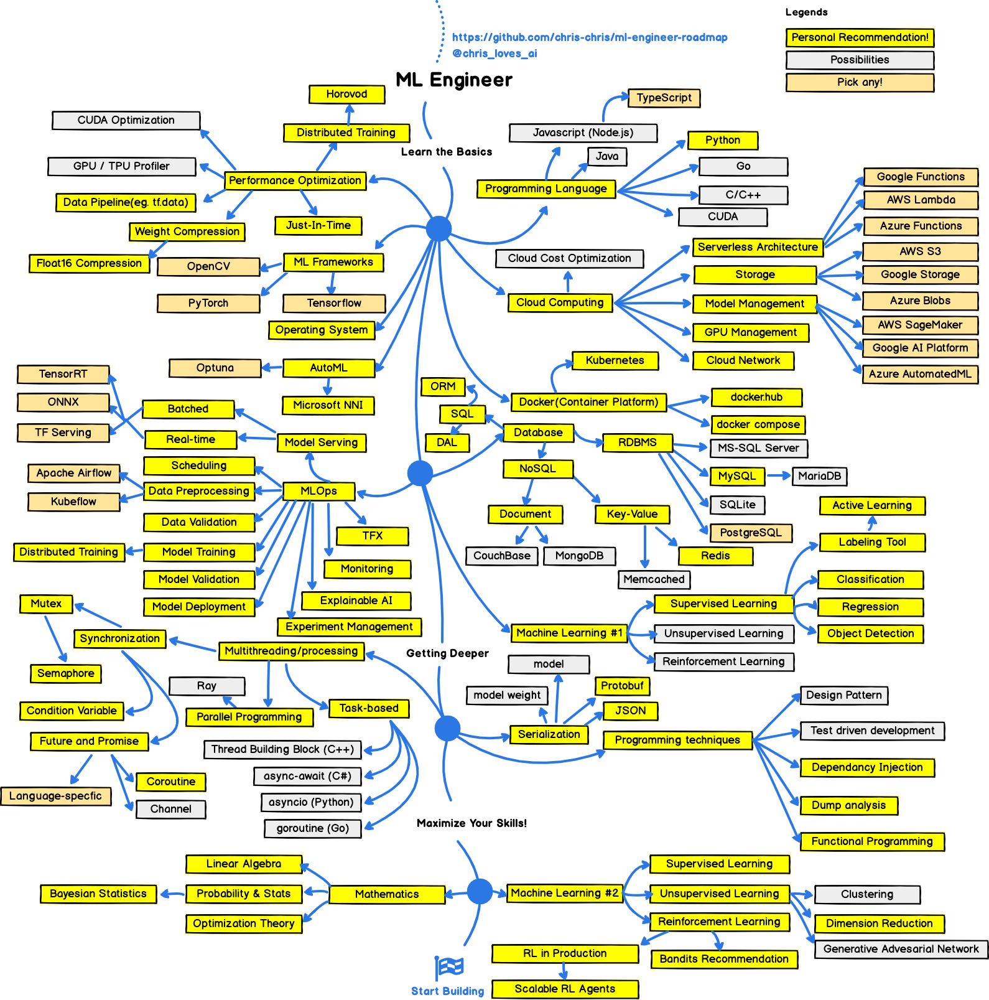

## ⚠️🚧 🚧 !!!This repository is still heavily under construction, do come back later.!!!🚧🚧 

# foundation-ml
A collection of implementation of classic ML algo(knn, svm, naive bayes, k-mean and etc,)

## Motivation
This project aims to provide simple and clear implementations of classic machine learning algorithms to help learners and practitioners understand their inner workings. Available in Python, Golang and Javascript.

## Getting Started
// TODO: update this section

## How to Use
// TODO: update this section

## Disclaimer
README files are generated by AI, mistakes are possible. Always review and fact-check. Report issue if you found one.

## License
This project is licensed under the MIT License. See the [LICENSE](LICENSE) file for details.

## Appendix

    
    
Source: https://github.com/chris-chris/ml-engineer-roadmap

This project focus on `Machine Learning #1` and `Machine Learning #2` as shown in the graph.