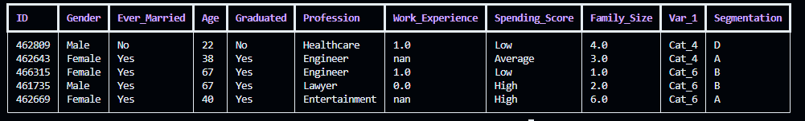
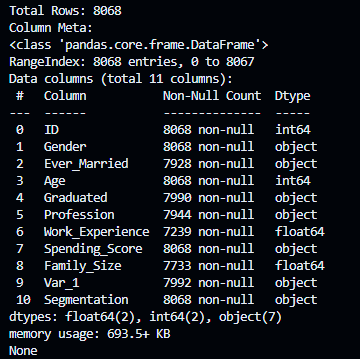

# Customer Segmentation Classification

## Data Source
This dataset is from [kaggle](https://www.kaggle.com/datasets/kaushiksuresh147/customer-segmentation/data)

## Data Exploration

1. Load Train.csv and check the "shape" of the data

    

    Columns:
    - `ID` - Unique ID
    - `Gender` - Gender of the customer
    - `Ever_Married` -  Marital status of the customer
    - `Age` - Age of the customer
    - `Graduated` - Is the customer a graduate?
    - `Profession` - Profession of the customer
    - `Work_Experience` - Work Experience in years
    - `Spending_Score` - Spending score of the customer
    - `Family_Size` - Number of family members for the customer (including the customer)
    - `Var_1` - Anonymised Category for the customer
Segmentation (target) Customer Segment of the customer

2. Check number of rows and columns metadata

    

